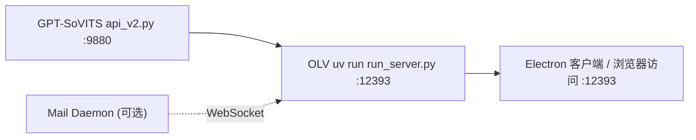

# GPT-SoVITS-V2 部署、训练与对接指南

本文档记录如何在本机部署 GPT-SoVITS-V2、训练专属音色，并把它接入到 AICompanion 项目。
本指南服务于 [`Open-LLM-VTuber/conf.example.yaml`](../Open-LLM-VTuber/conf.example.yaml) 中预配置的 `gpt_sovits_tts` TTS backend。

---

## 一、GPT-SoVITS-V2 是什么

由 RVC-Boss 维护的开源 TTS 项目，特点是 **3-10 秒参考音频即可零样本克隆音色**，并且支持用更长一点（≥1 分钟）的语料微调出更稳的专属模型。它分两个模型协同工作：

- **GPT 模型**：负责把文本转成音素 / 韵律 token 序列（`*.ckpt`，存放在 `GPT_weights_v2/`）
- **SoVITS 模型**：负责把 token + 参考音色合成最终波形（`*.pth`，存放在 `SoVITS_weights_v2/`）

调用时必须**同时**指定一个 GPT 权重 + 一个 SoVITS 权重 + 一段参考音频。

---

## 二、环境准备（Windows 推荐方式）

### 1. 下载官方整合包

1. 进入 [GPT-SoVITS Release](https://github.com/RVC-Boss/GPT-SoVITS/releases) 下载最新的 `GPT-SoVITS-v2-xxx-windows-package.7z`
2. 用 7-Zip 解压到一个**全英文路径**下（中文路径会引发奇怪错误）
3. 解压后目录里会看到 `go-webui.bat`、`api_v2.py`、`GPT_SoVITS/`、`tools/` 等

### 2. 预训练模型

- 整合包通常已附带；如缺失，启动时会自动从 HuggingFace 拉取
- 国内网络环境下建议手动从镜像下载并放到 `GPT_SoVITS/pretrained_models/`

### 3. 路径建议

**不要**把 GPT-SoVITS 放在 `D:\Coding\Python\AICompanion\` 内部，建议放到独立目录（例如 `D:\GPT-SoVITS-v2\`），避免污染 AICompanion 仓库。

---

## 三、训练自己的音色（完整流程）

GPT-SoVITS 提供了一站式 WebUI，整个训练流水线都在里面。

### 1. 准备语料

- 收集目标说话人 **1-30 分钟的清晰音频**（越长效果越好，1 分钟也能用）
- 推荐 wav 格式、16 kHz 或 32 kHz、单声道、无背景音乐
- 不需要事先切片，WebUI 会帮你切

### 2. 启动 WebUI

```powershell
cd D:\GPT-SoVITS-v2
.\go-webui.bat
```

浏览器自动打开 `http://localhost:9874`（端口可能略有不同，看终端输出）。

### 3. 走完 WebUI 顶部的四个 Tab（按顺序）

#### Tab "0-前置数据集获取工具"

| 步骤 | 操作 |
| --- | --- |
| 0a 语音切分 | 填入原始音频文件夹路径 → 点"开启语音切割"。会把长音频切成 3-10 秒的小段，输出到 `output/slicer_opt/` |
| 0b 语音降噪（可选） | 如果原始音频有底噪 |
| 0c 中文 / 英文 ASR | 选 `Faster Whisper Large V3`，对切片做转写，得到 `*.list` 文本标注文件 |
| 0d 校对标注（可选） | ASR 错字太多可手动修正 |

#### Tab "1-GPT-SoVITS-TTS"

**1A 训练集格式化**：
- "实验 / 模型名"：随便起，例如 `aki`
- "训练集音频目录"：上一步切片输出目录
- "训练集文本标注 list 文件"：上一步生成的 `.list`
- 然后**依次**点击 1Aa（提取文本）→ 1Ab（提取语音）→ 1Ac（提取语义 token）。三个步骤都跑完才能进入下一步

**1B 微调训练**：
- 先训练 SoVITS（左侧）：点"开启 SoVITS 训练"，看终端输出 epoch 进度
- 再训练 GPT（右侧）：点"开启 GPT 训练"
- 显存 < 6 GB 把 batch_size 调到 1-2；显存 12 GB+ 可以放心默认
- 默认各跑 8-15 epoch 就能听出效果，过多反而过拟合（说话像背书）

训练完成后，权重会自动出现在：

```
SoVITS_weights_v2/aki_e8_s48.pth
GPT_weights_v2/aki-e15.ckpt
```

#### Tab "1C 推理"（验证训练效果）

1. 点"刷新模型路径"，从下拉框选刚才训练好的 GPT 和 SoVITS
2. 点"开启 TTS 推理 WebUI"，会再起一个推理界面
3. 上传一段 3-10 秒的**新参考音频**（可以是训练集里没出现过的）
4. 输入参考音频对应的文字（必须**严格一致**）
5. 输入要合成的目标文本，点"合成语音"

如果这一步效果满意，就可以进入下一步给 OLV 接入。

---

## 四、启动 API v2 服务

WebUI 关掉（不然占着端口），在 GPT-SoVITS 根目录运行：

```powershell
cd D:\GPT-SoVITS-v2
python api_v2.py
```

- 默认监听 `http://127.0.0.1:9880`
- 启动时会**加载默认的预训练 GPT / SoVITS**——可以等需要时通过 `/set_gpt_weights` 和 `/set_sovits_weights` 切换到自己训练的权重，也可以加启动参数：

```powershell
python api_v2.py `
  -g GPT_weights_v2/aki-e15.ckpt `
  -s SoVITS_weights_v2/aki_e8_s48.pth `
  -a 9880
```

启动成功后看到 `Uvicorn running on http://0.0.0.0:9880` 就 OK。

### 健康检查

打开浏览器访问：

```
http://127.0.0.1:9880/tts?text=测试&text_lang=zh&ref_audio_path=参考音频绝对路径.wav&prompt_text=参考音频文字&prompt_lang=zh
```

如果直接听到声音，API 就跑通了。

### 主要端点速查

| 路径 | 用途 |
| --- | --- |
| `POST /tts` | 合成语音（OLV 用这个） |
| `GET/POST /set_gpt_weights?weights_path=...` | 切换 GPT 权重 |
| `GET/POST /set_sovits_weights?weights_path=...` | 切换 SoVITS 权重 |
| `POST /control` | 重启 / 停止服务 |

### `/tts` 关键参数

OLV 已经替你封装好，仅作理解用：

| 参数 | 说明 |
| --- | --- |
| `text` / `text_lang` | 要合成的文字 + 语种 |
| `ref_audio_path` | 3-10 秒的参考音频**绝对路径** |
| `prompt_text` / `prompt_lang` | 参考音频里**真实说出**的文本和语种 |
| `text_split_method` | 中文用 `cut5`（按标点切），英文用 `cut0` |
| `streaming_mode` | `true` 启用流式（显著降低首句延迟，桌宠场景强烈推荐） |
| `speed_factor` | 1.0 标准语速，0.9-1.1 区间最自然 |
| `top_k` / `top_p` / `temperature` | 采样参数，默认即可 |

---

## 五、对接到 AICompanion / OLV

[`Open-LLM-VTuber/conf.example.yaml`](../Open-LLM-VTuber/conf.example.yaml) 已预配好 `gpt_sovits_tts` 段，复制为 `conf.yaml` 后只需改 3 个字段：

```yaml
tts_config:
  tts_model: 'gpt_sovits_tts'      # 已是默认

  gpt_sovits_tts:
    api_url: 'http://127.0.0.1:9880/tts'
    text_lang: 'zh'
    ref_audio_path: 'D:/GPT-SoVITS-v2/refs/aki_3s.wav'   # 改成你自己的绝对路径
    prompt_lang: 'zh'
    prompt_text: '今天天气真好啊'                            # 上面那段音频里说的原话
    text_split_method: 'cut5'
    batch_size: '1'
    media_type: 'wav'
    streaming_mode: 'false'        # 想要更低延迟可改为 'true'
```

### 关键注意点

1. **`ref_audio_path` 必须是 API 服务能访问到的绝对路径**。GPT-SoVITS API 是单独的进程，OLV 只是把字符串透传过去，路径基准是 SoVITS 进程而不是 OLV 进程。
2. **`prompt_text` 必须精确匹配参考音频内容**，错一个字音色都会偏。
3. **如果用的是自训权重**，需要在启动 API 时通过 `-g/-s` 指定，或者用 `/set_*_weights` 端点切换；OLV 端不感知具体权重。

---

## 六、推荐的启动顺序

完全一致于 [`scripts/start-all.ps1`](../scripts/start-all.ps1) 的设计：



也就是说先把 SoVITS API 跑起来再启动 OLV，否则 OLV 首句 TTS 会失败。可以直接用：

```powershell
.\scripts\start-all.ps1 -SovitsPath "D:\GPT-SoVITS-v2"
```

它会自动开新窗口跑 SoVITS，等 10 秒再拉起 OLV。

---

## 七、常见坑

| 现象 | 原因 / 解决 |
| --- | --- |
| 启动 `api_v2.py` 报 CUDA OOM | 在 GPT-SoVITS WebUI 的 1B 训练页可见 batch_size 设置；推理时把环境变量 `CUDA_VISIBLE_DEVICES=` 设空走 CPU 也能跑，只是慢 |
| 合成出来的声音像机器人 | 训练 epoch 不够；建议 SoVITS 跑到至少 8 epoch、GPT 跑到至少 15 epoch |
| 合成出的声音像背书、没感情 | 训练 epoch 太多过拟合；回退到更早的 checkpoint |
| OLV 端首句卡几秒才出声 | 把 `streaming_mode` 改 `'true'`；同时确认 `faster_first_response: True` |
| API 提示 `ref audio not found` | `ref_audio_path` 路径写错或非英文 / 有空格；放到全英文路径并用绝对路径 |
| 中文标点处停顿过长 | 试试 `text_split_method: 'cut3'` 或 `'cut1'` |
| 训练 ASR 字错率高 | Tab 0c 选用 `Faster Whisper Large V3` 而不是 `Paraformer`；事后在 0d 手动校正 |
| `prompt_text` 写错音色不对 | 必须一字不差；连标点都要对，可以先用 0c 的 `.list` 里的转写文本作为参考 |

---

## 八、官方资料链接

- 项目主仓库：[RVC-Boss/GPT-SoVITS](https://github.com/RVC-Boss/GPT-SoVITS)
- 官方中文教程（语雀）：[白菜工厂 - GPT-SoVITS 文档](https://www.yuque.com/baicaigongchang1145haoyuangong/ib3g1e)
- API v2 源码（参数最权威的参考）：[api_v2.py](https://github.com/RVC-Boss/GPT-SoVITS/blob/main/api_v2.py)
- B 站教程：搜索"GPT-SoVITS V2 训练"会有大量可视化讲解视频

---

## 九、与项目的关联文件

| 文件 | 角色 |
| --- | --- |
| [`Open-LLM-VTuber/conf.example.yaml`](../Open-LLM-VTuber/conf.example.yaml) | 用户配置模板，含 `gpt_sovits_tts` 段 |
| [`scripts/start-all.ps1`](../scripts/start-all.ps1) | 编排脚本，按顺序启动 SoVITS → OLV → Mail Daemon |
| [`docs/polish_checklist.md`](polish_checklist.md) | 性能基线和延迟调优 checklist |
| [`README.md`](../README.md) | 顶层启动流程说明 |
